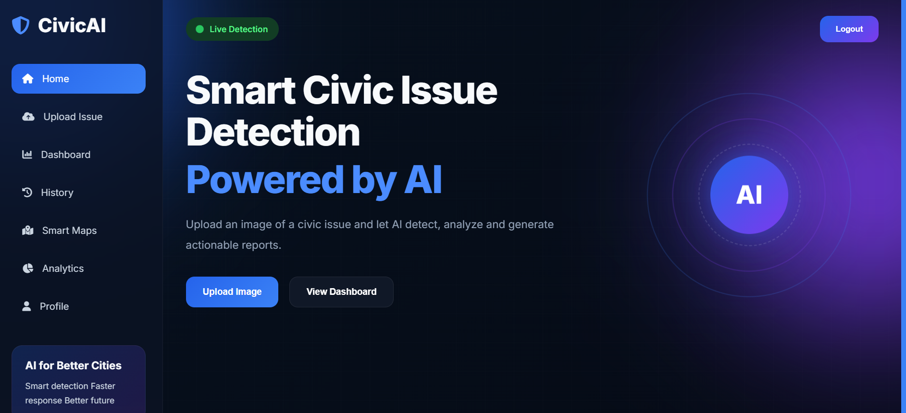
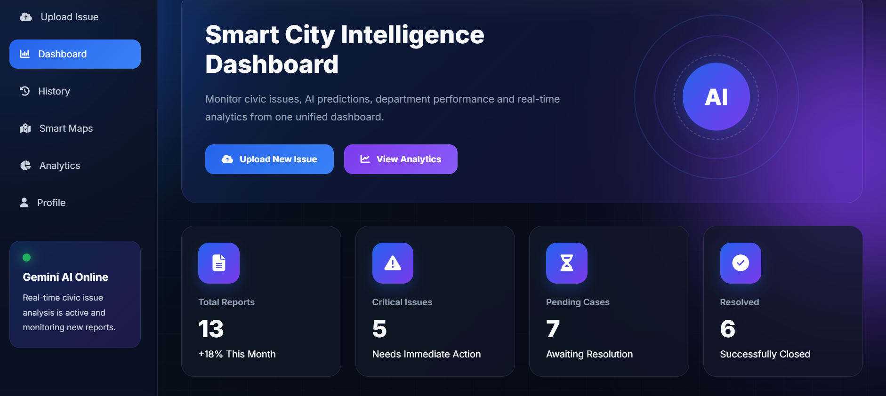
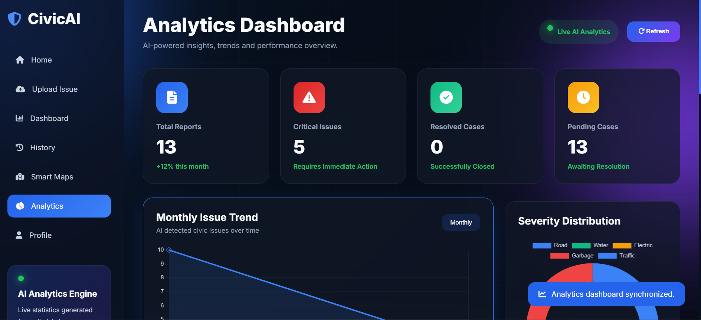
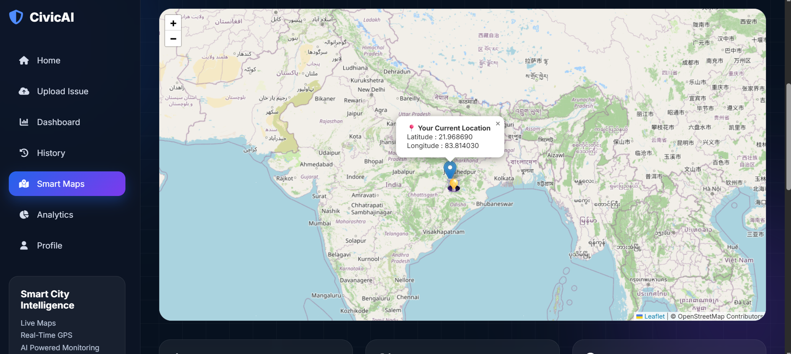
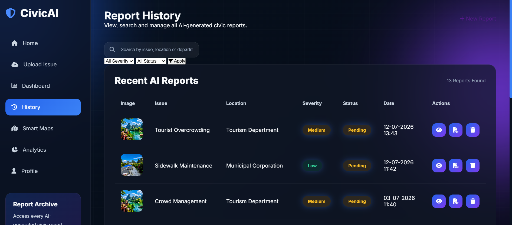
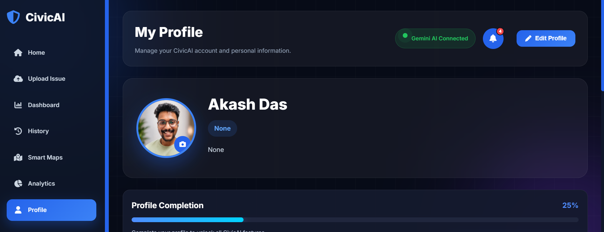

<div align="center">

# 🚀 CivicAI

### AI-Powered Community Issue Intelligence Platform

Built during the **Coding Ninjas × Google for Developers – Vibe2Ship Hackathon**

<p align="center">


</p>

### 🌐 Live Demo

https://civicai-4kqm.onrender.com

</div>

---

# 📖 About

**CivicAI** is an AI-powered civic issue reporting platform designed to simplify how citizens report public infrastructure problems.

Users can upload an image of an issue, and **Google Gemini AI** automatically analyzes it, identifies the issue category, predicts severity, recommends the responsible department, assigns priority, and generates an intelligent report.

This project was developed during the **Coding Ninjas × Google for Developers – Vibe2Ship Hackathon**, showcasing how Generative AI can enhance civic issue reporting and support smarter city management.

---

# ✨ Features

- 🤖 AI-Powered Image Analysis
- 📤 Smart Issue Reporting
- 📊 Interactive Analytics Dashboard
- 📜 Complaint History
- 📄 AI-Generated PDF Reports
- 👤 User Authentication
- 🔔 Notification System
- 🗺 Smart Maps
- ☁️ Cloud Deployment (Render)

---

# 🛠 Tech Stack

| Category | Technologies |
|----------|--------------|
| Frontend | HTML • CSS • JavaScript |
| Backend | Python • Flask |
| AI | Google Gemini 2.5 Flash |
| Database | SQLite |
| Visualization | Chart.js |
| Deployment | Render |

---

# 🏆 Hackathon

Developed during the

## **Coding Ninjas × Google for Developers**

# **Vibe2Ship Hackathon**

> 🏅 **Hackathon participation certificate will be added soon.**

---

# 📸 Screenshots

## 🏠 Home

<p align="center">

</p>

---

## 📤 Dashboard

<p align="center">

</p>

---

## 🤖 AI Analysis

<p align="center">

</p>

---

## 📊 Maps

<p align="center">

</p>

---

## 📈 History

<p align="center">

</p>

---

## 👤 Profile

<p align="center">

</p>

---

# ⚙️ Run Locally

Clone the repository

```bash
git clone https://github.com/akhubdev/CivicAI.git
```

Go to the project directory

```bash
cd CivicAI
```

Install dependencies

```bash
pip install -r requirements.txt
```

Run the application

```bash
python app.py
```

---

# 👨‍💻 Developer

## Akash Das

**Data Analyst • Python Developer • AI & Machine Learning Enthusiast**

**GitHub**  
https://github.com/akhubdev

**LinkedIn**  
https://linkedin.com/in/akashdastech

---

<div align="center">

## ⭐ If you found this project helpful,

### Consider giving it a Star ⭐

Made with ❤️ by **Akash Das**

</div>
